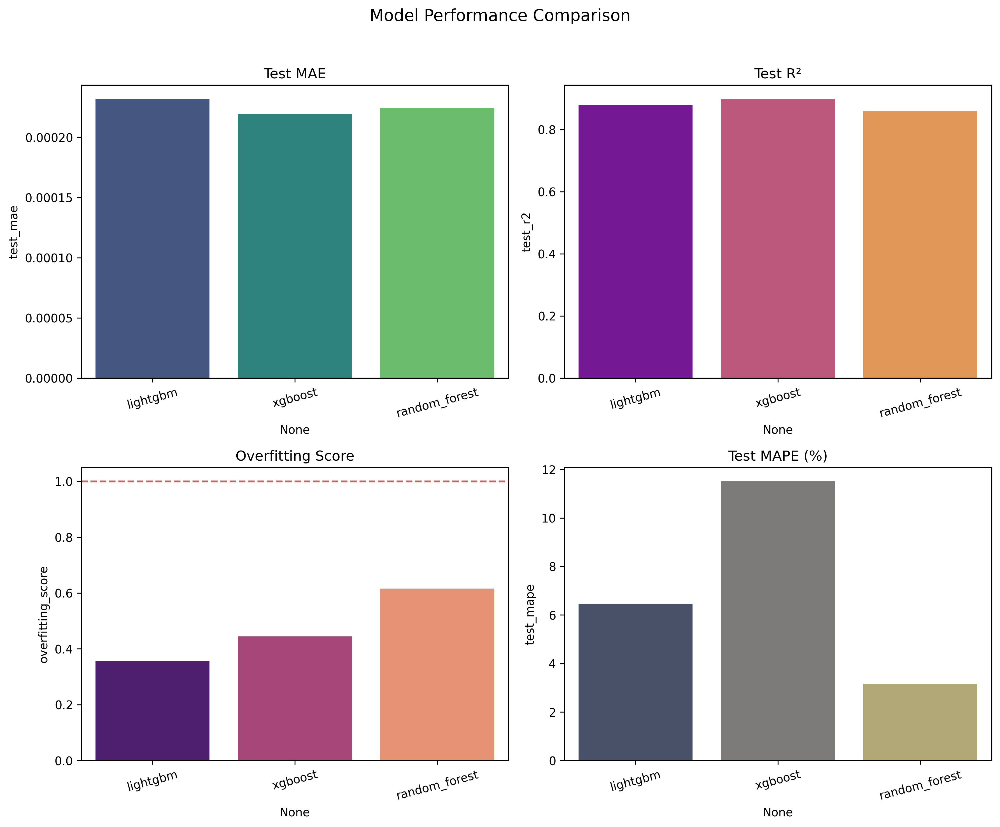
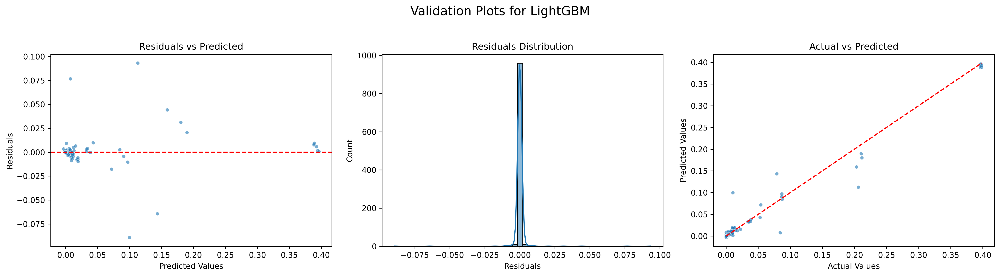

# Nara: AI-Powered Trade Execution Cost Predictor

Nara is an advanced machine learning project designed to predict the true execution cost of a cryptocurrency trade. It moves beyond simple price comparison by modeling complex market dynamics like slippage and liquidity to provide realistic cost estimations and recommend the optimal exchange for execution.

At its core, this repository contains a two-part pipeline:
1.  **A sophisticated dataset generator** that simulates trades against live market data to create a rich, realistic training set.
2.  **A model training suite** that uses this dataset to train, evaluate, and compare multiple regression models to find the most accurate predictor.

---

## 🚀 The Core Problem: Advertised Price vs. Real Cost

When executing a large trade, the price you see is rarely the price you get. Factors like order size, market depth, and volatility lead to **slippage**, where the final execution price deviates from the expected price.

Nara solves this problem. If you ask, *“What’s the best market to sell 1 BTC?”*, Nara won’t just show the highest advertised price — it will recommend the exchange where you’ll **actually receive the most money** after the trade is complete.

---

## ⚙️ How It Works: A White-Box View

The system is built on a continuously trained machine learning model that understands the intricate relationships between market conditions and trade outcomes.

### Stage 1: Realistic Dataset Generation (`trade_cost_dataset.py`)

The foundation of any good model is great data. Since a public dataset for realistic slippage doesn't exist, we built our own. This script:

-   **Ingests Real-Time Data**: Constantly pulls live order book data and recent trade history from major exchanges (Binance, Kraken, Coinbase, etc.) using `ccxt`.
-   **Engineers Advanced Features**: Extracts over 30 market microstructure features for each snapshot, including:
    -   *Liquidity & Depth*: Volume available at different price levels.
    -   *Market Volatility*: Recent price fluctuations and trade frequency.
    -   *Order Book Imbalance*: Ratio of buy-to-sell pressure.
    -   *Price Impact Slope*: Sensitivity of price to large orders.
-   **Simulates Trades Realistically**: Walks the live order book for thousands of simulated trades, modeling slippage, partial fills, exchange-specific fee structures, and volatility multipliers to generate a proprietary dataset.

### Stage 2: Predictive Modeling (`model_training.py`)

Once the dataset is generated, this script takes over to:

-   **Engineer Interaction Features**: Creates new features that capture complex relationships (e.g., `size_volatility_interaction`, `depth_spread_ratio`).
-   **Train Multiple Models**: Trains and hyper-tunes several powerful gradient boosting models, including LightGBM, XGBoost, and a Random Forest baseline.
-   **Evaluate and Compare**: Rigorously evaluates the models on a test set using metrics like Mean Absolute Error (MAE) and R² to select the best-performing model.
-   **Save Artifacts**: Saves the trained models, data scalers, and feature lists for future deployment.

---

## 🧠 What the AI Prioritizes

Our LightGBM model has learned that the most critical predictors of final trade cost are:

-   **Order Size (Fiat Value)**: Larger trades relative to market depth have the strongest impact on slippage.
-   **Spread Percentage**: The gap between buy and sell prices significantly affects execution efficiency.
-   **Size vs. Spread Ratio & Volatility Spread**: How order size interacts with market volatility and spread conditions.
-   **Order Book Depth**: Availability of liquidity across different levels (e.g., top 1 level, top 10 levels, and 5–10 depth ratios).

Other factors such as trade volume, order book imbalance, and depth utilization still contribute, but with less influence compared to the above.


---

## 📊 Model Performance

After training on the generated dataset, the models were compared. LightGBM consistently provided the best balance of speed and accuracy, making it the ideal choice for this prediction task.



### Validation
The model's predictions on the test set show a strong correlation with the actual simulated slippage values, indicating its effectiveness in capturing the underlying market dynamics.



---

## 🔧 Getting Started

Follow these steps to set up the project and run the pipeline on your local machine.

### Prerequisites

-   Python 3.8+
-   Pip for package management

### Installation

1.  **Clone the repository:**
    ```bash
    git clone [https://github.com/gitarRacing/ChainPrice.git](https://github.com/gitarRacing/ChainPrice.git)
    cd ChainPrice
    ```

2.  **Create and activate a virtual environment:**
    ```bash
    # For macOS/Linux
    python3 -m venv venv
    source venv/bin/activate

    # For Windows
    python -m venv venv
    venv\Scripts\activate
    ```

3.  **Install the required dependencies:**
    ```bash
    pip install -r requirements.txt
    ```

### Usage

The project is a two-step process. You must run the data generation first, followed by model training.

#### Step 1: Generate the Training Dataset

Run the `trade_cost_dataset.py` script to start collecting data and simulating trades. You can configure the number of samples to generate.

```bash
python scripts/trade_cost_dataset.py
````

This will create a file named `enhanced_trade_cost_dataset.csv` in the root directory. This may take a significant amount of time depending on the number of samples and API rate limits.

#### Step 2: Train the Prediction Models

Once the dataset is ready, run the `model_training.py` script to train the models.

```bash
python scripts/model_training.py
```

This script will:

  - Load `enhanced_trade_cost_dataset.csv`.
  - Train LightGBM, XGBoost, and Random Forest models.
  - Generate and save the performance comparison and feature importance plots in the `assets/` directory.
  - Save the final trained model files (`.pkl`) in the `models/` directory.

-----

## 📁 Project Structure

```
ChainPrice/
├── .gitignore          # Files to be ignored by Git
├── README.md           # This file
├── requirements.txt    # Project dependencies
├── assets/             # For storing generated plots and images
├── data/               # To store the generated .csv dataset (ignored by git)
├── models/             # To store saved .pkl model files (ignored by git)
├── scripts/            # Main executable scripts
│   ├── trade_cost_dataset.py
│   └── model_training.py
└── src/                # Source code for core logic (predictors, etc.)
    └── deployment_predictor.py
```
